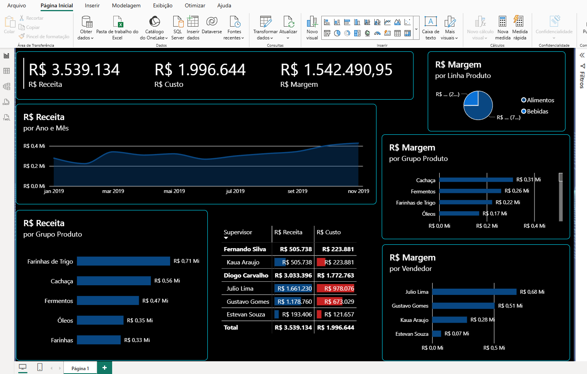

# 📊 Análise de Dados com Power BI

## 📌 Sobre o projeto
Este projeto foi desenvolvido com o objetivo de transformar dados brutos em informações estratégicas por meio da criação de um dashboard interativo no Power BI.

## 🎯 Objetivo
Analisar dados de vendas e produtos, gerando indicadores que auxiliem na tomada de decisão.

## 🚀 Etapas do projeto

### 🔹 Tratamento de dados (Power Query)
- Filtro e organização de datas (ano e mês em coluna única)
- Limpeza e padronização dos dados

### 🔹 Modelagem de dados
- Relacionamento entre tabela de vendas e tabela de produtos
- Estruturação do modelo para melhor análise

### 🔹 Criação de métricas
- Cálculo de custo unitário
- Cálculo de receita
- Cálculo de margem de lucro

### 🔹 Desenvolvimento do dashboard
- Criação de gráficos e indicadores visuais
- Organização das informações para fácil interpretação

## 🛠️ Ferramentas utilizadas
- Power BI (Power Query e Modelagem)
- Excel (base de dados)

## 📊 Insights obtidos
- Visualização clara da relação entre custo, receita e margem
- Identificação de padrões nas vendas ao longo do tempo
- Melhor entendimento do desempenho dos produtos

## 📷 Preview do Dashboard

## 📎 Arquivos
- Base de vendas
- Cadastro de produtos
- Arquivo `.pbix` disponível neste repositório

## 👨‍💻 Autor
Eduardo de Souza Leite
